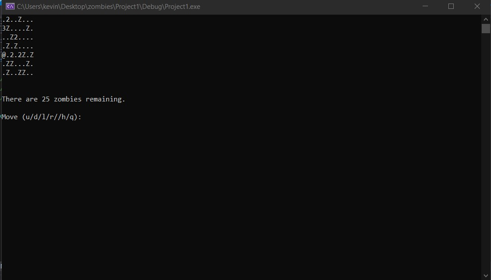

# ZombieAttack
A project from UCLA's 32 course where we had to design a program where a user will have traverse and avoid zombies.
## Author: Kevin Delao

## Table of contents

* [Introduction](#intro)
* [General info](#general-info)
* [Technologies](#technologies)
* [Site](#site)
* [Setup](#setup)

## Introduction
This project involved creating a simple world with the C++ terminal where a user would traverse a 2D world and avoid zombies in the environmet. This was a simple project where the zombies and user 
were represented with symbols. More specifically ther user was represented by an @ symbol and the zombies were represent with a Z. The game itself is turn based where the user performs a movement first and
then each of the zombies perform a random movement themselves.

## General info
This application was built in C++ and was the first project for UCLA's CS 32 course. This project was a precourser to the much more complex project 3 BoulderBlast which is also available on my Github.
	
## Technologies
Project was created with:
* C++
* Visual Studios

## Site

### Homepage
When the application starts the player will be placed in a 2D world with possible locations and zombies as well. Each start of the application will create a random world so each world created is unique.
From the world the user will have the option to move in different directions left, right, up, and down. Additionally the user can hide the world and quite the game as well.

### Moving Around the World
Once the user selects a movement and does not die in the process, the user will move to a new location and the zombies will update their position as well. Additionally, the UI will show how many zombies
are left and how many steps the user has lasted.
  

 
### Dying After Moving
If the player dies after moving a step the will be notified of how many steps the user survived for and they have died as well. From there the user can quit the world and reload to try again to player
to play the game.
 
 
 
### Hiding the World
One feature that the game does have is that the user has the option to hide the game by pushing 'h' to essentially pause the game. From there the user can push enter to come back to the game again.

  
 

## Setup
To run this project simply run the project and the UI will show up.

